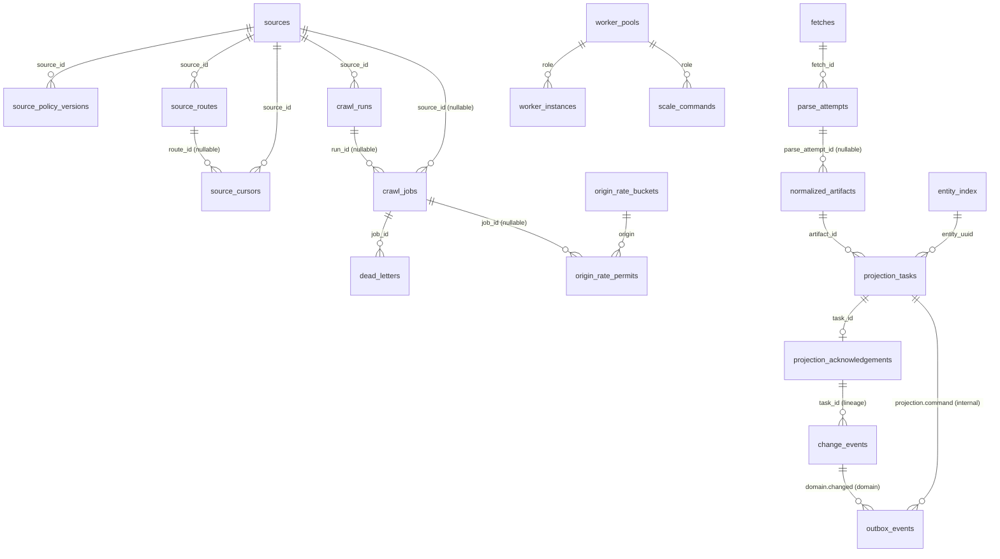

# PostgreSQL — схема control plane, artifacts і projection (WP-01A PR1+PR2)

Огляд PostgreSQL-схеми, яку створює й підтримує WP-01A (§9.1, §13 ТЗ). Документ покриває
**PR1** (`wp/01a-1-control-queue`, ревізії `0001_control_queue` → `0002_claim_index` →
`0003_default_partition`): control plane джерел, job queue, глобальний origin rate limiter,
worker pools і масштабування, append-only audit log — і **PR2** (`wp/01a-2-artifacts-projection`,
ревізії `0004_artifacts_projection` → `0005_entity_version_guard`): fetch/raw lineage, upload
claims, normalized artifact pointers, projection tasks/acks, transactional outbox, entity index.
Разом — 23 таблиці.

**Таблиці PR3** (news/translations/matching/release/retention/capacity) ще не існують у схемі —
цей документ оновиться разом з наступним PR WP-01A.

Джерело істини для схеми — SQLAlchemy-моделі `src/collector/persistence/postgres/models/**`;
Alembic-ревізії в `migrations/postgres/versions/**` — їх forward-only знімки. Опис нижче
звірений з обома і з живою схемою (тести `tests/integration/postgres/test_schema_contract.py`,
`test_metadata.py`, звіти `docs/plan/reports/WP-01A/{implementation,code-review,spec-review}-pr1.md`,
`docs/plan/reports/WP-01A/{implementation,code-review-pr2-r2,spec-review}-pr2.md`). Рішення
поза буквою ТЗ (партиціювання PR2, ідемпотентність `record_parse_result`) — `docs/decisions/
0007-event-tables-global-unique-over-partitioning.md`.

## 1. Таблиці

| Таблиця | Призначення |
|---|---|
| `sources` | реєстр джерел: canonical `source_id`, домен, країна, `state` (`SourceState`), optimistic `revision` |
| `source_policy_versions` | immutable знімки policy-частини маніфесту джерела (rate limit, розклад, robots, `manifest_sha256`) |
| `source_routes` | маршрути джерела (rss/sitemap/category/detail/api/browser) зі станом circuit breaker |
| `source_cursors` | opaque курсори discovery (page token / ETag / watermark) за `(source_id, cursor_kind, cursor_key)` |
| `crawl_runs` | обходи джерела (`full`/`incremental`/`replay`/`backfill`); не більше одного running `full` на джерело |
| `crawl_jobs` | job queue §7.2: lease, priority, `not_before`, idempotency key, `attempt/max_attempts` |
| `dead_letters` | job-и, що вичерпали `max_attempts` або отримали ручний `quarantine` |
| `origin_rate_buckets` | canonical token bucket + concurrency budget на normalized origin (R-53) |
| `origin_rate_permits` | видані leased permits (rate token + concurrency slot) |
| `worker_pools` | desired state worker pool (role, replicas, concurrency, min/max, mode) з optimistic revision |
| `worker_instances` | зареєстровані instance-и: статус, heartbeat, slots, підтверджена pool revision |
| `scale_commands` | аудитовані команди масштабування зі станами §7.6 |
| `audit_log` | append-only журнал mutating actions §13, партиційований по місяцях |
| `fetches` | HTTP-запити: requested/final URL, метадані відповіді, `raw_sha256`, timestamps; RANGE-партиціонована по `fetched_at` + DEFAULT-партиція `fetches_default` |
| `raw_objects` | сирі байти за content hash: UUID PK `raw_object_id`, unique `sha256`, `uri/size`; непартиціонована (ADR-0007) |
| `parse_attempts` | спроби parse конкретного fetch: `parser_version`, вихід/помилка, lineage `fetch_id`/`raw_sha256` |
| `artifact_upload_claims` | fencing-претензії на upload ключ об'єктного сховища: unique `object_key`, `claim_generation`, owner, lease |
| `normalized_artifacts` | pointer на normalized artifact: `entity_uuid`, `sha256/uri/size`, domain/schema version, raw/fetch/parser lineage; без domain payload |
| `projection_tasks` | черга projection: monotonic `projection_version`, `parse_key` (ідентичність parse-кроку, ADR-0007 D-2), unique `(entity_uuid, projection_version)` |
| `projection_acknowledgements` | PK `task_id`; Mongo receipt, `applied_to_current`/`state_changed`, previous/result hash |
| `entity_index` | PK `entity_uuid`; `confirmed_projection_version` (монотонна, тригер-guard), unique source identity, Mongo collection/document ID |
| `change_events` | доменні події зміни стану: unique `event_id`, bounded `event_bytes`; непартиціонована (ADR-0007) |
| `outbox_events` | transactional outbox для `projection.command`(internal)/`domain.changed`(domain): unique `event_id`, visibility lease, паркування; непартиціонована (ADR-0007) |

## 2. ER-схема



`scale_commands.audit_id`/`audit_created_at` — свідомо **без FK** на `audit_log`: партиційована
таблиця дозволяє drop старої партиції maintenance-циклом, і це не повинно ламати історичні
команди масштабування. `raw_objects` і `artifact_upload_claims` свідомо не показані FK-стрілками
до `fetches`/`normalized_artifacts` — lineage-колонки (`raw_sha256`, `raw_uri`, `fetch_id`)
зберігаються **без FK**, щоб видалення raw object (retention) не руйнувало lineage-запис у
записах, що на нього посилалися (§9.1: «Видалення raw object … не повинно руйнувати lineage
record»).

## 3. Transaction boundaries

Спільний контракт усіх функцій `repositories/**` (module-docstring `repositories/__init__.py`):
перший аргумент — `AsyncSession`, репозиторій **не викликає** `commit()`/`rollback()` — межу
транзакції визначає викликач; час — параметр `now`, не `now()` бази; помилки — типізовані
`errors.*`, не `sqlalchemy.exc.*`. Кожна публічна функція має власний docstring із
transaction boundary; нижче — підсумок за групами операцій.

### Queue (`repositories/queue.py`, §7.2)

| Операція | Межа транзакції |
|---|---|
| `claim` | `SELECT … FOR UPDATE SKIP LOCKED` на кандидатів + `UPDATE …→leased` — одна транзакція; викликач комітить одразу після виклику (row locks тримаються до commit) і виконує роботу **поза** цією транзакцією |
| `heartbeat` | один `UPDATE` з предикатом `status='leased' AND lease_owner=:owner` |
| `complete` | один `UPDATE`; викликач зазвичай об'єднує з записом результату (artifact pointer / outbox — PR2) у тій самій транзакції |
| `retry` | `SELECT … FOR UPDATE` рядка + `UPDATE`, і за потреби `INSERT dead_letters` — усе в одній транзакції (`_quarantine_locked`) |
| `quarantine` | так само, як `retry`, при `max_attempts` |
| `recover_expired_leases` | один `UPDATE … RETURNING` з `SKIP LOCKED` (щоб не чекати рядки, які саме heartbeat-яться); maintenance/scheduler tick |
| `enqueue` | `INSERT … ON CONFLICT DO NOTHING` + `SELECT` — **вимагає READ COMMITTED** (розділ 4) |

`claim` читає partial index `ix_crawl_jobs_claimable_order` у точному порядку `ORDER BY
priority DESC, not_before, job_id`; `FOR UPDATE SKIP LOCKED` — вимога §7.2, а не оптимізація:
без нього claimers серіалізуються на зайнятих рядках (замінено на plain `FOR UPDATE` у
мутаційному тесті — набір сповільнюється ~8×, але не дає подвійного claim; повна відсутність
row lock натомість дає подвійний claim — `testing-pr1.md` §5, мутації M1a/M1b).

### Limiter (`repositories/limiter.py`, §7.6/R-53)

`acquire_permit` — одна коротка транзакція викликача з `SELECT … FOR UPDATE` на рядок
`origin_rate_buckets`: усі replicas discovery/fetch/browser серіалізуються на bucket, тож
видача детермінована незалежно від кількості контейнерів (canonical, без локального кешу
токенів). Алгоритм у межах цієї транзакції:

1. `blocked_until` у майбутньому → відмова `blocked`;
2. поповнення rate tokens за `refill_per_second` від `last_refill_at` до `now` (cap
   `capacity_tokens`) — стан refill комітиться навіть при відмові;
3. live concurrency = `COUNT(*)` permits із `released_at IS NULL AND lease_expires_at > now`;
4. permit видається лише коли `tokens >= 1` **і** `live < max_concurrency`; rate token
   списується тільки при видачі — відмова через concurrency не «спалює» rate.

`release_permit`/`expire_permits` — окремі короткі UPDATE з предикатом `released_at IS NULL`
(ідемпотентні). `block_origin` — `SELECT … FOR UPDATE` на bucket в одній транзакції з очищенням
стану refill (`available_tokens=0`, `last_refill_at=until`), щоб час блокування не
конвертувався в burst після зняття.

### Pools (`repositories/pools.py`, §7.6)

| Операція | Межа транзакції |
|---|---|
| `upsert_pool` | одна транзакція: валідація інваріантів **до** запису (`InvalidValueError`), потім INSERT/UPDATE з optimistic revision |
| `heartbeat_instance` / `set_instance_status` | `SELECT … FOR UPDATE` рядка instance + `UPDATE` — одна транзакція |
| `mark_stale_instances` | один `UPDATE … RETURNING` (maintenance tick) |
| `request_scale` | **одна транзакція**: `SELECT … FOR UPDATE` на pool + desired state update (revision+1) + supersede активних команд role + `append_audit` + `INSERT scale_commands` |
| `transition_scale_command` | `SELECT … FOR UPDATE` команди + (для `applied`) read-only перевірка `observed_capacity` у тій самій транзакції + `UPDATE` статусу |

`request_scale` — єдина операція PR1, де audit гарантовано транзакційний (докладніше — розділ
7 і `spec-review-pr1.md` S-2). **PR2** поширив той самий патерн на решту mutating-операцій
control plane: `set_source_state`, `add_policy_version`, `upsert_route` (лише при створенні),
`set_route_state`, `upsert_cursor` (кожен виклик), `limiter.block_origin` (лише коли блок
справді подовжено), `queue.quarantine(owner=None)`, `pools.upsert_pool` (create і update) —
усі тепер пишуть `append_audit` **усередині** власної транзакції, з обов'язковими `actor`/
`reason` (`require_audit_context` відмовляє `InvalidValueError` до першого запису на порожні
значення); `queue.release(job_id, owner)` (PR2, dependency WP-01D) — жодного audit-запису,
`attempt` не змінюється, `last_error_*` не пишуться (плановий drain — не помилка job-и).

### Audit (`repositories/audit.py`, §13)

`append_audit` — одна транзакція, викликається **всередині** транзакції mutating-дії (патерн
`request_scale`), щоб не було дії без сліду і сліду без дії. З `idempotency_key` — best effort
ідемпотентність (розділ 5.1): SELECT існуючого запису перед INSERT, а не DB-level unique.

### Artifacts і upload claims (`repositories/artifacts.py`, §10 п.5, R-38/R-41)

| Операція | Межа транзакції |
|---|---|
| `record_fetch` | один `INSERT` |
| `record_raw_object` | `INSERT … ON CONFLICT (sha256) DO NOTHING` + `SELECT` — дедуплікація за `sha256`, lineage першої появи не переписується повторним `record_raw_object` того самого вмісту |
| `acquire_upload_claim` | `SELECT … FOR UPDATE` за `object_key` (якщо рядок є) + INSERT/UPDATE — reacquire атомарно інкрементує `claim_generation` і змінює owner; живий чужий lease → `StaleClaimError`; вже `committed` ключ не перебирається |
| `commit_reference` | один `UPDATE` з предикатом `owner = :owner AND claim_generation = :generation AND status = 'leased' AND lease_expires_at > now()` — керована конкурентність без явного lock; повторний виклик тим самим `sha256` ідемпотентний |
| `release_claim` / `expire_claims` | короткі `UPDATE` з предикатом стану |
| `list_orphan_candidates(grace)` | read-only `SELECT` — claims без DB-посилання (ні `committed`, ні знайдений `raw_objects`/`normalized_artifacts`) і без живого claim (lease сплив понад `grace` тому); викликач (sweeper WP-02/WP-12) видаляє з object storage і лише потім `release_claim`/`expire_claims` |

### Projection (`repositories/projection.py`, §7.3 кроки 2/4, §9.5, ADR-0007 D-2)

| Операція | Межа транзакції |
|---|---|
| `record_parse_result` | **одна транзакція**: узгодженість lineage (`attempt.fetch_id`/`raw_sha256`/`parser_version`/`domain` == `artifact_ref`, інакше `InvalidValueError` до першого запису) → `SELECT entity_index … FOR UPDATE` (row lock — атомарна видача `projection_version`) → `normalized_artifacts ON CONFLICT (object_key) DO NOTHING` → `parse_attempts INSERT` → `projection_version = existing + 1` → `projection_tasks INSERT` за unique `(entity_uuid, projection_version)` і `parse_key` → `outbox_events INSERT (projection.command, topic=internal)`. Повторний виклик з тим самим `parse_key` (той самий parse-крок) повертає існуючий task, `created=False` — ідемпотентність за ідентичністю parse-кроку, не за вмістом artifact (ADR-0007) |
| `claim_projection_tasks` / `heartbeat_projection_task` / `retry_projection_task` / `quarantine_projection_task` | той самий патерн, що `queue.claim`/`heartbeat`/`retry`/`quarantine` (розділ «Queue»), над `projection_tasks` |
| `release_projection_task` | симетричний до `queue.release`: `leased → pending`, `attempt` не змінюється, без audit |
| `recover_expired_projection_leases` | `UPDATE … RETURNING` з `SKIP LOCKED`, maintenance tick |
| `acknowledge_projection` | **одна транзакція**: `projection_acknowledgements INSERT … ON CONFLICT (task_id) DO NOTHING` (повторний ack ідемпотентний, повертає наявний рядок) → `entity_index.confirmed_projection_version = GREATEST(existing, receipt.projection_version)` (ніколи не зменшується — тригер `entity_index_versions_monotonic`, міграція `0005`, форсує це навіть для `collector_migrate`) → `projection_tasks.status = 'succeeded'` → лише якщо `applied_to_current AND state_changed`: `change_events INSERT` + `outbox_events INSERT (domain.changed, topic=domain)` з `event_bytes`/hash **з receipt без reserialization** |

### Outbox publisher (`repositories/outbox.py`, §7.3, R-30) — lease і паркування

Доставка — **щонайменше один раз**, ідемпотентність за `event_id` — обов'язок consumer-а.

| Операція | Межа транзакції |
|---|---|
| `fetch_unpublished(limit, topics=(domain,), lock=True)` | коротка транзакція: `SELECT … FOR UPDATE SKIP LOCKED` за index `(published_at, available_at, event_id)` + **visibility lease** — вибраним рядкам `available_at` зсувається на `visibility_seconds` (типово 60 с) уперед, транзакція одразу комітиться. Інший publisher не бачить ці рядки ні паралельно (row lock), ні одразу після commit (до спливу lease); якщо publisher упав між `fetch_unpublished` і `mark_published`/`mark_failed`, рядок знову стає видимим після lease — звідси «щонайменше один раз». За замовчуванням — лише `topic='domain'` (fail-closed: внутрішня `projection.command` назовні не публікується, R-30) |
| `mark_published` | ідемпотентний `UPDATE` (`published_at`); повторний виклик для вже опублікованого рядка — no-op |
| `mark_failed(attempts, error, backoff)` | `UPDATE` з `BackoffPolicy`; після `max_attempts` (типово 10) рядок **паркується** (`parked_at`) і `fetch_unpublished` більше його не віддає, доки оператор не викличе `unpark` |
| `list_parked` / `unpark` | read-only вибірка запаркованих рядків / `UPDATE parked_at = NULL` операторським рішенням |
| `get_event` / `count_backlog` / `oldest_unpublished_age(topics=(domain,))` | read-only; `oldest_unpublished_age` узгоджена з `count_backlog` щодо `topic`/`parked_at` (виключає опубліковані й запарковані) |

Доставка публікується поза транзакцією БД (мережевий виклик до Mongo/шини) — `mark_published`/
`mark_failed` викликається **після** цього, окремою короткою транзакцією.

### Entity index (`repositories/entities.py`, §15 keyset)

| Операція | Межа транзакції |
|---|---|
| `upsert_entity` | `INSERT … ON CONFLICT (source_id, source_item_id) DO UPDATE … WHERE IS DISTINCT FROM` — ідемпотентна за unique source identity, лічильники версій не чіпає |
| `get_confirmed_version` / `find_entity` | read-only |
| `set_mongo_document` | `UPDATE` `mongo_collection`/`mongo_document_id` |
| `list_entities(domain, after=(confirmed_projection_version, entity_uuid), limit)` | read-only keyset pagination через row comparison `(confirmed_projection_version, entity_uuid) > (:v, :uuid)` за index `entity_index(domain, confirmed_projection_version, entity_uuid)` — без `OFFSET` (§15) |

## 4. Вимога READ COMMITTED

Ідемпотентність `enqueue` (`INSERT … ON CONFLICT DO NOTHING` + `SELECT`) тримається на тому, що
кожен statement у **READ COMMITTED** (default PostgreSQL) бере свіжий snapshot і бачить рядок,
щойно закомічений конкурентною транзакцією. Якщо викликач відкриє транзакцію в `REPEATABLE
READ`/`SERIALIZABLE`, конкурентний commit того самого `idempotency_key` робить
`ON CONFLICT DO NOTHING` несеріалізовним, і PostgreSQL кидає `could not serialize access due to
concurrent update` — режим відмови гучний (виняток), а не тихий дубль; транзакцію потрібно
повторити цілком. Перевірено `tests/integration/postgres/test_queue.py::
test_enqueue_outside_read_committed_fails_loudly_without_duplicating`. Викликачі не повинні
відкривати транзакцію з `enqueue` на вищому рівні ізоляції.

## 5. Партиціонування `audit_log` і `fetches`; чому решта PR2-таблиць не партиціонована

`audit_log` і `fetches` — `RANGE (created_at)`/`RANGE (fetched_at)` партиціонування, PK
`(audit_id, created_at)`/`(fetch_id, fetched_at)` (вимога партиційного ключа в PK). Два типи
партицій (обидві таблиці):

- **місячні** `audit_log_yYYYYmMM` — створює `partitions.ensure_month_partitions(conn,
  months_ahead=N)`, викликається CLI `collector db migrate` (за замовчуванням на 3 місяці
  наперед від поточного) і maintenance-циклом WP-12; **не** частина Alembic-ревізій, бо їхня
  кількість залежить від дати виконання;
- **DEFAULT** `audit_log_default` — створює **міграція** `0003_default_partition` (не
  runtime-код): страховка на випадок, якщо maintenance пропустить місяць. Без неї чистий
  `alembic upgrade head` (перший крок CI і команда перевірки картки) робив `append_audit`
  неможливим для будь-якого mutating-action control plane одразу після встановлення схеми
  (знахідка M-5 код-рев'ю — `request_scale` пише audit у тій самій транзакції, що й зміну
  desired state, тож без партиції під поточний місяць команда масштабування падала цілком).

Межі місячної партиції задаються як `timestamptz` з явним `+00`
(`'2031-03-01 00:00:00+00'`), а не голим date-літералом: голий літерал інтерпретується у
`TimeZone` сесії, що виконує DDL, і партиції, створені з різних сесій (різний `PGTZ`,
non-UTC `postgresql.conf`), або перекриваються, або лишають діру між місяцями (знахідка M-1
код-рев'ю, `partitions.py::MonthPartition.create_sql`).

Рядки в DEFAULT-партиції — сигнал «партиції відстають» (метрика
`partitions.default_partition_row_count`, `TODO(WP-12)` для публікації в §14.1/алерт §14.2), не
нормальний режим роботи: поки вони там, місячну партицію того самого періоду створити не
можна (PostgreSQL сканує DEFAULT і відмовляє, якщо в ній є рядки нового діапазону) — спершу
потрібно перенести їх (`BEGIN; CREATE TABLE … LIKE parent; INSERT … SELECT … WHERE …; DELETE
…; ATTACH PARTITION …; COMMIT` — обслуговування WP-12).

`fetches` отримала DEFAULT-партицію (`fetches_default`) у міграції `0004_artifacts_projection`
за тим самим патерном, що `audit_log_default` у `0003` — той самий сигнал
`default_partition_row_count`, той самий helper `ensure_month_partitions` (`PARTITIONED_TABLES =
("audit_log", "fetches")`). Downgrade/upgrade цикл коректно від'єднує й повторно приєднує
`fetches_default` (`test_migrations.py::
test_fetches_default_partition_survives_downgrade_and_is_reattached`).

**`raw_objects`, `change_events`, `outbox_events` — свідомо не партиціоновані** (ADR-0007,
`docs/decisions/0007-event-tables-global-unique-over-partitioning.md`): їхній головний
інваріант — глобальний unique (`sha256`/`event_id`), а PostgreSQL вимагає, щоб unique-ключ
партиційованої таблиці включав partition key, що зробило б дедуплікацію помісячною. Для
гіпотетичних майбутніх партиційованих таблиць **без** DEFAULT-партиції INSERT у місяць без
партиції дає зрозумілу помилку PostgreSQL (`no partition of relation "…" found for row`) —
контракт «зрозуміла помилка замість auto-create», покритий тестом
(`test_migrations.py::test_partitioned_table_without_default_still_fails_clearly`); для
`audit_log`/`fetches` це не застосовується, бо в обох є DEFAULT-партиція.

Alembic autogenerate ігнорує child-таблиці (`partitions.is_partition_child_name`, `include_name`
у `env.py`) — інакше `alembic check` бачив би їх як «зайві таблиці» відносно моделей.

## 6. Індекси

### Обов'язкові за карткою (R-32)

| Index | Таблиця | Призначення |
|---|---|---|
| `ix_crawl_jobs_status_not_before_priority (status, not_before, priority, job_id)` | `crawl_jobs` | операторські вибірки й фільтри за `(status, not_before)` |
| unique `uq_crawl_jobs_idempotency_key (idempotency_key)` | `crawl_jobs` | ідемпотентність `enqueue` |
| `ix_crawl_jobs_lease_expires_at (lease_expires_at) WHERE status='leased'` | `crawl_jobs` | `recover_expired_leases` |
| `ix_origin_rate_permits_origin_lease_expires_at (origin, lease_expires_at)` | `origin_rate_permits` | підрахунок live permits в `acquire_permit` |
| `ix_worker_instances_role_status_last_heartbeat_at (role, status, last_heartbeat_at)` | `worker_instances` | `observed_capacity`, `mark_stale_instances` |
| `ix_audit_log_created_at (created_at)` | `audit_log` (партиційно, `ON ONLY`) | успадковується кожною партицією |
| unique partial `uq_crawl_runs_running_full (source_id) WHERE status='running' AND kind='full'` | `crawl_runs` | FR-002 — один running full run на джерело |
| `ix_projection_tasks_status_not_before_priority (status, not_before, priority, task_id)` | `projection_tasks` | claim projection-черги (§9.1 PR2) |
| unique `uq_projection_tasks_entity_version (entity_uuid, projection_version)` | `projection_tasks` | монотонна версія на сутність |
| unique `uq_projection_tasks_parse_key (parse_key)` | `projection_tasks` | ідемпотентність `record_parse_result` за ідентичністю parse-кроку (ADR-0007 D-2) |
| `ix_outbox_events_published_at_available_at_event_id (published_at, available_at, event_id)` | `outbox_events` | `fetch_unpublished` (§9.1 PR2) |
| unique `uq_outbox_events_event_id (event_id)` | `outbox_events` | ідемпотентність доставки за `event_id` (R-30) |
| `ix_entity_index_domain_confirmed_version_uuid (domain, confirmed_projection_version, entity_uuid)` | `entity_index` | keyset pagination `list_entities` (§15) |
| unique `uq_raw_objects_sha256 (sha256)` | `raw_objects` | глобальна дедуплікація за вмістом (§9.3 п.4, ADR-0007) |
| unique `uq_change_events_event_id (event_id)` | `change_events` | ідемпотентність доменних подій змін (ADR-0007) |
| partial `ix_projection_tasks_claimable_order` (`status`, предикат) | `projection_tasks` | той самий патерн, що `ix_crawl_jobs_claimable_order` (нижче) — hot path claim |
| partial `ix_outbox_events_unpublished` | `outbox_events` | hot path `fetch_unpublished` без опублікованих/запаркованих рядків |

### `0002_claim_index` — партійний index під hot path `claim`

Обов'язковий index картки має `status` на провідній позиції, тож на `status IN
('pending','retry')` PostgreSQL не читає його у порядку `ORDER BY priority DESC, not_before,
job_id` — доводиться сортувати всю чергу. Вимір на 400 000 pending jobs (gate 2, PostgreSQL 18,
той самий запит `claim`, `LIMIT 3`):

```text
-- лише обов'язковий index (status, not_before, priority, job_id)
Seq Scan on crawl_jobs (rows=400000) → Sort (external merge, 18800kB) → Execution Time: 331.638 ms
```

Тому статус винесено у предикат окремого partial index (`0002_claim_index`):

```sql
CREATE INDEX ix_crawl_jobs_claimable_order ON crawl_jobs (priority DESC, not_before, job_id)
    WHERE status IN ('pending', 'retry');
```

```text
Index Scan using ix_crawl_jobs_claimable_order → Execution Time: 0.182 ms
```

**331 мс → 0.18 мс (≈1800×).** Обов'язковий index картки лишається — обидва мають різне
призначення (незалежно підтверджено `code-review-pr1.md`, I-4: `EXPLAIN` на 200 000 pending
показує `Index Scan using ix_crawl_jobs_claimable_order`). Предикат будується з константи
`CLAIMABLE_JOB_STATUSES`/`CLAIMABLE_PREDICATE` (`models/queue.py`), тож index і `claim` не
можуть розійтися — перевірено `test_metadata.py::
test_claimable_predicate_matches_statuses_used_by_claim` і, на живій БД,
`test_schema_contract.py::test_claim_index_predicate_in_database_matches_claimable_statuses`.
Ціна — ще один btree на найгарячішій таблиці, обмежена тим, що index partial (рядок зникає з
нього, щойно job переходить у `leased/succeeded/quarantined`): 24 МБ проти 29 МБ повного
index-у при тих самих 400 000 pending.

### Чому `alembic check` не ловить дрейф CHECK/предикатів

Alembic autogenerate не порівнює текст CHECK-констрейнтів і `WHERE`-предикат partial index-ів
із моделями — `alembic check` бачить `No new upgrade operations detected` навіть якщо хтось
підмінив `ck_sources_state` або предикат `ix_crawl_jobs_claimable_order` прямим DDL в обхід
Alembic (відтворено код-рев'ю, знахідка M-3). Тому `tests/integration/postgres/
test_schema_contract.py` (15 тестів) читає `pg_get_constraintdef`/`pg_indexes.indexdef` **з
живої БД** і звіряє їх зі значеннями `collector.contracts.enums`/`CLAIMABLE_JOB_STATUSES` —
контрактна зміна (наприклад, нове значення `SourceState`) ламає цей набір тестів, а не лишає
runtime-помилку на production. Нову CHECK-константу або partial index варто супроводжувати
аналогічним тестом.

## 7. Ролі БД, LOGIN, column-level GRANT і RLS (§13)

Канонічний скрипт — `src/collector/persistence/postgres/sql/roles.sql`, застосовується CLI
`collector db roles [--sql PATH]` (ідемпотентно, після `collector db migrate`, повторюється
після кожної міграції, яка змінює GRANT). Скрипт створює/тримає ролі `NOLOGIN` і жодного
пароля не містить — LOGIN і паролі вмикає окрема команда (розділ 7.2).

| Роль | Компонент | Права (PR1 + PR2) |
|---|---|---|
| `collector_migrate` | лише міграції | owner усіх таблиць/функцій (`ALTER TABLE … OWNER TO`); LOGIN не отримує; **не** використовується runtime-кодом (`test_role_connections.py::test_migrate_role_is_not_referenced_by_runtime_code`) |
| `collector_scheduler` | scheduler + controller + maintenance + outbox publisher | control plane/queue/limiter/pools/audit RW (PR1); PR2: SELECT на fetch/artifact/projection-таблиці, column-level UPDATE на `projection_tasks` (lease/status/attempt, не `parse_key`/версію/identity), `outbox_events` (available/published/parked/attempts, не payload/topic), `artifact_upload_claims` (sweeper-колонки) — `recover_expired_projection_leases`, `expire_claims`, `fetch_unpublished`/`mark_published`/`mark_failed` |
| `collector_fetcher` | discovery/fetch/browser workers | control plane read + `crawl_jobs`/permits/routes/cursors (PR1); PR2: SELECT/INSERT на `fetches`, `raw_objects`; SELECT/INSERT/UPDATE на `artifact_upload_claims` |
| `collector_parser` | parse workers | queue (PR1); PR2: upload claims для normalized artifact-ів, INSERT на `parse_attempts`/`normalized_artifacts`, column-level UPDATE `normalized_artifacts(parse_attempt_id)` лише (pointer незмінний, CR-6/S-2), column-level INSERT/UPDATE на `entity_index` (лише identity-колонки й `projection_version` — версії/`confirmed_at`/`mongo_*` недосяжні, F-1/S-1), INSERT на `projection_tasks`/`outbox_events` з RLS-обмеженням `topic=internal` (нижче); жодного SELECT на `audit_log`, лише INSERT |
| `collector_projector` | projector workers | worker_instances (PR1); PR2: SELECT `normalized_artifacts`; column-level UPDATE `projection_tasks` (лише lease/status/attempt-колонки — `parse_key`/`projection_version`/`artifact_id`/`entity_uuid`/`parse_attempt_id` незмінні, N-4 gate 4); column-level UPDATE `entity_index(confirmed_projection_version, confirmed_at, mongo_collection, mongo_document_id, updated_at)`; INSERT на `projection_acknowledgements`, `change_events`, `outbox_events` |
| `collector_translation` | translation workers | те саме, що `collector_projector` у PR1 (PR3 додасть news/translations) |
| `collector_api_ro` | operator/read API | SELECT усіх 23 таблиць, нічого більше |
| `collector_export_ro` | exporter | SELECT усіх 23 таблиць, нічого більше |

Спільні гарантії, перевірені `tests/integration/postgres/test_role_connections.py` (17 тестів,
PR1) і `test_role_logins.py` (17 тестів, PR2) через окремі login-з'єднання, не `SET ROLE`
із superuser-сесії:

- жодна runtime-роль не має UPDATE/DELETE на `audit_log` — GRANT відсутній, і тригер
  `audit_log_append_only` відхиляє це навіть для owner (`collector_migrate`);
- `collector_api_ro`/`collector_export_ro` не можуть INSERT/UPDATE/DELETE/TRUNCATE жодної
  таблиці й не бачать `alembic_version`/DDL;
- `collector_parser` не має жодного SELECT на `audit_log`, лише INSERT (bootstrap `upsert_pool`
  пише audit), і не може переписати `parse_key`/версію/lineage;
- `collector_projector` не пише artifact pointers (`normalized_artifacts`) і не може переписати
  identity-колонки `projection_tasks`;
- `collector_migrate` ніде не згадується в runtime-коді (лише `roles.py`/`sql/roles.sql`);
- жоден runtime-логін не є членом `collector_migrate` і не має власного `CREATEDB`/`REPLICATION`
  (`verify_runtime_login`, gate 4 N-5).

### 7.1. Column-level GRANT

Для декількох таблиць (`projection_tasks`, `outbox_events`, `normalized_artifacts`,
`entity_index`, `artifact_upload_claims` — залежно від ролі) табличний `UPDATE`/`INSERT` явно
`REVOKE`-ується перед видачею колонкового GRANT: повторний запуск `collector db roles` на вже
застосованій раніше (ширшій) схемі прав інакше лишив би табличний grant — column-level GRANT
звужує попередній, а не замінює його автоматично. Мета — щоб роль могла оновити стан прогресу
(lease/status/attempt/timestamps), але не могла переписати те, що визначає ідентичність рядка
(`parse_key`, `projection_version`, `artifact_id`, `entity_uuid`, event `topic`/payload).
Джерело правди — коментарі безпосередньо в `sql/roles.sql` над кожним REVOKE/GRANT-блоком, зі
згадкою знахідки (F-1, S-1..S-3, N-4), яка їх ввела.

### 7.2. LOGIN, SCRAM verifier, `db roles --with-login`

Group-ролі з `sql/roles.sql` самі по собі — `NOLOGIN`: жоден процес не може підключитись ними
напряму, доки не виконано окрему команду:

```bash
collector db roles --with-login [--secrets-dir DIR]
```

За замовчуванням `--secrets-dir` бере `$COLLECTOR_POSTGRES_ROLE_SECRETS_DIR` або `/run/secrets`.

- Для кожної з семи runtime-ролей (`collector_scheduler`, `collector_fetcher`,
  `collector_parser`, `collector_projector`, `collector_translation`, `collector_api_ro`,
  `collector_export_ro`) читає DSN-секрет `postgres_dsn_<component>` (усі сім обов'язкові —
  без будь-якого exit 1, без змін у БД);
- ставить runtime-роль у LOGIN з атрибутами `NOSUPERUSER NOCREATEDB NOCREATEROLE NOREPLICATION
  NOBYPASSRLS INHERIT` і паролем-verifier; verifier рахується в Python за RFC 5802/7677
  (SCRAM-SHA-256), відкритий пароль на сервер не йде;
- логін = сама group-роль (не окремий `fetch_01`-користувач); користувач у DSN має дорівнювати
  ролі, інакше відмова;
- роль-член `collector_migrate` (пряме чи транзитивне) → відмова, LOGIN не встановлюється;
- `collector db roles` без `--with-login` виданих раніше логінів не вимикає (PR1-поведінка
  лишається сумісною);
- `collector_migrate` LOGIN ніколи не отримує — міграції виконує окремий login (dev —
  superuser `POSTGRES_USER`).

Старт runtime-процесу (worker/scheduler) очікувано викликає
`collector.persistence.postgres.roles.verify_runtime_login(conn)`: одна перевірка після
підключення, яка відмовляє (`RoleLoginError`), якщо процес підключився superuser-ом, членом
`collector_migrate`, або сам має `CREATEDB`/`REPLICATION`. Наразі не викликається — старт з
per-role DSN і сам виклик `verify_runtime_login` чекають на переведення compose-сервісів
(dependency `docs/plan/deps/WP-01A-to-WP-01D.md`).

### 7.3. Row Level Security на `outbox_events`

`outbox_events` містить обидва топіки (`internal`/`domain`) в одній таблиці. Column/table
GRANT не можуть виразити «parser бачить/пише лише internal», тому на таблицю ввімкнено RLS
(`ALTER TABLE outbox_events ENABLE ROW LEVEL SECURITY`, три `CREATE POLICY`):
`outbox_events_all` (FOR ALL, без обмежень) — для `collector_scheduler`, `collector_projector`,
`collector_api_ro`, `collector_export_ro`; `outbox_events_parser_select`/
`outbox_events_parser_insert` (USING/WITH CHECK `topic = 'internal'`) — лише для
`collector_parser`. `collector_parser` фізично не може ні прочитати, ні вставити рядок
`topic='domain'` — підробка `domain.changed` parser-ом (яка на рівні самого repository-коду й
так неможлива, бо `record_parse_result` завжди пише `topic=internal`) додатково закрита на
рівні БД. Owner (`collector_migrate`) і superuser RLS обходять за замовчуванням — міграції й
maintenance не зачеплені.

## 8. Як додати нову міграцію

1. Нова ревізія в `migrations/postgres/versions/` (шаблон `script.py.mako`, назва —
   `YYYYMMDD_NNNN_опис.py`, послідовна за `down_revision`); **forward-only**: `downgrade`
   реалізується повністю лише де це безпечно, інакше — `raise NotImplementedError(...)` з
   поясненням (production відкат — новий forward-fix, не `downgrade`; dev — `alembic downgrade
   base` під volume, який однаково можна знищити).
2. DDL міграції пишеться **літералом**, не імпортом runtime-модулів (`models`, `partitions`):
   історична ревізія — замороджений знімок схеми на момент застосування; якщо в майбутньому
   PR зміниться формат, наприклад, імені DEFAULT-партиції, сенс уже застосованої історичної
   ревізії не повинен змінитися заднім числом (знахідка S-4 пострев'ю — `0003` цьому не
   слідувала і має бути виправлена в PR2).
3. Якщо міграція додає enum-подібну колонку (`TEXT` + CHECK, не PG enum) — CHECK будується
   через `models.base.enum_check(column, ContractEnum, name)` у моделі, а сама CHECK-умова в
   міграції — окремий текстовий literal, звірений з тим самим enum (`enum_check` гарантує
   збіг у моделі; для БД — окремий тест, розділ 6 «Чому `alembic check` не ловить дрейф»).
4. Якщо міграція додає партиційовану таблицю — RANGE `(created_at)`/`(fetched_at)`-подібна
   колонка в PK; додати назву таблиці до `partitions.PARTITIONED_TABLES` і створити
   DEFAULT-партицію **в тій самій міграції** (`partitions.default_partition_sql`, як
   зроблено для `audit_log` у `0003`; місячні партиції все одно створює `collector db
   migrate`/maintenance, не міграція).
5. Локальна перевірка (ті самі команди, що й acceptance PR1):

   ```bash
   uv run alembic upgrade head && uv run alembic check
   uv run alembic downgrade base && uv run alembic upgrade head   # де downgrade реалізовано
   uv run collector db migrate --check
   uv run pytest -m integration tests/integration/postgres
   ```

   `alembic check` без drift — обов'язкова умова; вона **не** ловить розходження CHECK-тексту
   чи partial index-предиката (розділ 6) — новий контрактний enum/partial index потребує
   власного `test_schema_contract.py`-подібного тесту, що читає `pg_get_constraintdef`/
   `pg_indexes.indexdef` із живої БД.
6. Якщо міграція змінює таблицю, на яку є GRANT у `sql/roles.sql`, — оновити GRANT там-таки і
   перезастосувати `collector db roles`.

## 9. `worker_pools`: `desired` vs `current`

§9.1 називає для `worker_pools` «desired/current replicas + concurrency» — це можна прочитати
як вимогу зберігати `current` у таблиці. Реалізація свідомо цього **не** робить: §7.6 прямо
формулює `current` як **heartbeat-derived** («`applied` дозволений лише коли heartbeat-derived
current replicas/concurrency відповідають desired revision»). Тому:

- `worker_pools` зберігає лише **desired** state (`desired_replicas`, `desired_concurrency`,
  `min/max_replicas`, `mode`, `revision`) — колонок `current_replicas`/`current_concurrency`
  немає;
- джерело істини для `current` — `repositories.pools.observed_capacity(session, role)`:
  кількість `ready`-instances зі свіжим heartbeat (TTL за замовчуванням 60 с), сума
  `slots_total`, мінімальна підтверджена `pool_revision` серед них;
- саме `observed_capacity` звіряє `transition_scale_command('applied')` перед тим, як дозволити
  перехід — окрема колонка була б другим, розсинхронізованим джерелом істини: після смерті
  instance вона лишалась би застарілою і давала б хибний `applied`.

**Наслідок для споживачів (WP-01D, WP-11A):** читайте поточний стан через
`observed_capacity`/`transition_scale_command`, а не шукайте `current_replicas` у рядку
`worker_pools` — такої колонки немає і не буде (зафіксовано `spec-review-pr1.md` S-3,
docstring `repositories/pools.py`).

## Джерела

- Код: `src/collector/persistence/postgres/{models,repositories,partitions.py,migrations.py,
  ops.py,roles.py,errors.py,config.py,engine.py,clock.py}`, `sql/roles.sql`,
  `migrations/postgres/versions/{20260922_0001_control_queue,20260922_0002_claim_index,
  20260922_0003_default_partition,20260923_0004_artifacts_projection,
  20260923_0005_entity_version_guard}.py`.
- Тести: `tests/integration/postgres/**`, `tests/unit/persistence/postgres/**`.
- Звіти: `docs/plan/reports/WP-01A/{implementation,testing,code-review,spec-review}-pr1.md`,
  `docs/plan/reports/WP-01A/{implementation,code-review,code-review-pr2-r2,security,
  spec-review}-pr2.md`.
- ADR: `docs/decisions/0005-postgres-queue-and-outbox.md`, `docs/decisions/
  0007-event-tables-global-unique-over-partitioning.md`.
- Картка: `docs/plan/cards/WP-01A.md`.
- Dependency: `docs/plan/deps/WP-01A-to-WP-00.md`, `docs/plan/deps/WP-01A-to-WP-01D.md`,
  `docs/plan/deps/WP-01A-to-WP-02.md`.
