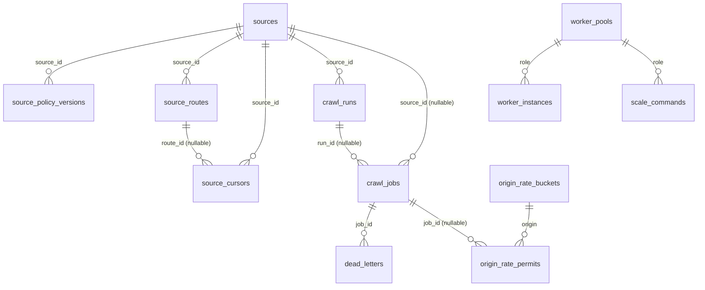

# PostgreSQL — схема control plane (WP-01A PR1)

Огляд PostgreSQL-схеми, яку створює й підтримує WP-01A (§9.1, §13 ТЗ). Документ покриває
**лише PR1** (`wp/01a-1-control-queue`, ревізії `0001_control_queue` → `0002_claim_index` →
`0003_default_partition`): control plane джерел, job queue, глобальний origin rate limiter,
worker pools і масштабування, append-only audit log. Разом — 13 таблиць.

**Таблиці PR2** (`fetches`, `raw_objects`, `parse_attempts`, `artifact_upload_claims`,
`normalized_artifacts`, `projection_tasks`, `projection_acknowledgements`, `entity_index`,
`change_events`, `outbox_events`) і **PR3** (news/translations/matching/release/retention/
capacity) ще не існують у схемі — цей документ оновиться разом з кожним наступним PR WP-01A.

Джерело істини для схеми — SQLAlchemy-моделі `src/collector/persistence/postgres/models/**`;
Alembic-ревізії в `migrations/postgres/versions/**` — їх forward-only знімки. Опис нижче
звірений з обома і з живою схемою (тести `tests/integration/postgres/test_schema_contract.py`,
`test_metadata.py`, звіти `docs/plan/reports/WP-01A/{implementation,code-review,spec-review}-pr1.md`).

## 1. Таблиці

| Таблиця | Призначення |
|---|---|
| `sources` | реєстр джерел: canonical `source_id`, домен, країна, `state` (`SourceState`), optimistic `revision` |
| `source_policy_versions` | immutable знімки policy-частини маніфесту джерела (rate limit, розклад, robots, `manifest_sha256`) |
| `source_routes` | маршрути джерела (rss/sitemap/category/detail/api/browser) зі станом circuit breaker |
| `source_cursors` | opaque курсори discovery (page token / ETag / watermark) за `(source_id, cursor_kind, cursor_key)` |
| `crawl_runs` | обходи джерела (`full`/`incremental`/`replay`/`backfill`); не більше одного running `full` на джерело |
| `crawl_jobs` | job queue §7.2: lease, priority, `not_before`, idempotency key, `attempt/max_attempts` |
| `dead_letters` | job-и, що вичерпали `max_attempts` або отримали ручний `quarantine` |
| `origin_rate_buckets` | canonical token bucket + concurrency budget на normalized origin (R-53) |
| `origin_rate_permits` | видані leased permits (rate token + concurrency slot) |
| `worker_pools` | desired state worker pool (role, replicas, concurrency, min/max, mode) з optimistic revision |
| `worker_instances` | зареєстровані instance-и: статус, heartbeat, slots, підтверджена pool revision |
| `scale_commands` | аудитовані команди масштабування зі станами §7.6 |
| `audit_log` | append-only журнал mutating actions §13, партиційований по місяцях |

## 2. ER-схема



`scale_commands.audit_id`/`audit_created_at` — свідомо **без FK** на `audit_log`: партиційована
таблиця дозволяє drop старої партиції maintenance-циклом, і це не повинно ламати історичні
команди масштабування.

## 3. Transaction boundaries

Спільний контракт усіх функцій `repositories/**` (module-docstring `repositories/__init__.py`):
перший аргумент — `AsyncSession`, репозиторій **не викликає** `commit()`/`rollback()` — межу
транзакції визначає викликач; час — параметр `now`, не `now()` бази; помилки — типізовані
`errors.*`, не `sqlalchemy.exc.*`. Кожна публічна функція має власний docstring із
transaction boundary; нижче — підсумок за групами операцій.

### Queue (`repositories/queue.py`, §7.2)

| Операція | Межа транзакції |
|---|---|
| `claim` | `SELECT … FOR UPDATE SKIP LOCKED` на кандидатів + `UPDATE …→leased` — одна транзакція; викликач комітить одразу після виклику (row locks тримаються до commit) і виконує роботу **поза** цією транзакцією |
| `heartbeat` | один `UPDATE` з предикатом `status='leased' AND lease_owner=:owner` |
| `complete` | один `UPDATE`; викликач зазвичай об'єднує з записом результату (artifact pointer / outbox — PR2) у тій самій транзакції |
| `retry` | `SELECT … FOR UPDATE` рядка + `UPDATE`, і за потреби `INSERT dead_letters` — усе в одній транзакції (`_quarantine_locked`) |
| `quarantine` | так само, як `retry`, при `max_attempts` |
| `recover_expired_leases` | один `UPDATE … RETURNING` з `SKIP LOCKED` (щоб не чекати рядки, які саме heartbeat-яться); maintenance/scheduler tick |
| `enqueue` | `INSERT … ON CONFLICT DO NOTHING` + `SELECT` — **вимагає READ COMMITTED** (розділ 4) |

`claim` читає partial index `ix_crawl_jobs_claimable_order` у точному порядку `ORDER BY
priority DESC, not_before, job_id`; `FOR UPDATE SKIP LOCKED` — вимога §7.2, а не оптимізація:
без нього claimers серіалізуються на зайнятих рядках (замінено на plain `FOR UPDATE` у
мутаційному тесті — набір сповільнюється ~8×, але не дає подвійного claim; повна відсутність
row lock натомість дає подвійний claim — `testing-pr1.md` §5, мутації M1a/M1b).

### Limiter (`repositories/limiter.py`, §7.6/R-53)

`acquire_permit` — одна коротка транзакція викликача з `SELECT … FOR UPDATE` на рядок
`origin_rate_buckets`: усі replicas discovery/fetch/browser серіалізуються на bucket, тож
видача детермінована незалежно від кількості контейнерів (canonical, без локального кешу
токенів). Алгоритм у межах цієї транзакції:

1. `blocked_until` у майбутньому → відмова `blocked`;
2. поповнення rate tokens за `refill_per_second` від `last_refill_at` до `now` (cap
   `capacity_tokens`) — стан refill комітиться навіть при відмові;
3. live concurrency = `COUNT(*)` permits із `released_at IS NULL AND lease_expires_at > now`;
4. permit видається лише коли `tokens >= 1` **і** `live < max_concurrency`; rate token
   списується тільки при видачі — відмова через concurrency не «спалює» rate.

`release_permit`/`expire_permits` — окремі короткі UPDATE з предикатом `released_at IS NULL`
(ідемпотентні). `block_origin` — `SELECT … FOR UPDATE` на bucket в одній транзакції з очищенням
стану refill (`available_tokens=0`, `last_refill_at=until`), щоб час блокування не
конвертувався в burst після зняття.

### Pools (`repositories/pools.py`, §7.6)

| Операція | Межа транзакції |
|---|---|
| `upsert_pool` | одна транзакція: валідація інваріантів **до** запису (`InvalidValueError`), потім INSERT/UPDATE з optimistic revision |
| `heartbeat_instance` / `set_instance_status` | `SELECT … FOR UPDATE` рядка instance + `UPDATE` — одна транзакція |
| `mark_stale_instances` | один `UPDATE … RETURNING` (maintenance tick) |
| `request_scale` | **одна транзакція**: `SELECT … FOR UPDATE` на pool + desired state update (revision+1) + supersede активних команд role + `append_audit` + `INSERT scale_commands` |
| `transition_scale_command` | `SELECT … FOR UPDATE` команди + (для `applied`) read-only перевірка `observed_capacity` у тій самій транзакції + `UPDATE` статусу |

`request_scale` — єдина операція PR1, де audit гарантовано транзакційний (докладніше — розділ
7 і `spec-review-pr1.md` S-2). Для решти mutating-операцій control plane (`set_source_state`,
`add_policy_version`, `upsert_route`/`set_route_state`, `upsert_cursor`, `block_origin`,
`quarantine(owner=None)`, `upsert_pool` поза scale-командою) audit лишається **обов'язком
викликача** у PR1 — у PR2 ці операції отримають той самий транзакційний audit, що й
`request_scale` (картка WP-01A, розділ PR2).

### Audit (`repositories/audit.py`, §13)

`append_audit` — одна транзакція, викликається **всередині** транзакції mutating-дії (патерн
`request_scale`), щоб не було дії без сліду і сліду без дії. З `idempotency_key` — best effort
ідемпотентність (розділ 5.1): SELECT існуючого запису перед INSERT, а не DB-level unique.

## 4. Вимога READ COMMITTED

Ідемпотентність `enqueue` (`INSERT … ON CONFLICT DO NOTHING` + `SELECT`) тримається на тому, що
кожен statement у **READ COMMITTED** (default PostgreSQL) бере свіжий snapshot і бачить рядок,
щойно закомічений конкурентною транзакцією. Якщо викликач відкриє транзакцію в `REPEATABLE
READ`/`SERIALIZABLE`, конкурентний commit того самого `idempotency_key` робить
`ON CONFLICT DO NOTHING` несеріалізовним, і PostgreSQL кидає `could not serialize access due to
concurrent update` — режим відмови гучний (виняток), а не тихий дубль; транзакцію потрібно
повторити цілком. Перевірено `tests/integration/postgres/test_queue.py::
test_enqueue_outside_read_committed_fails_loudly_without_duplicating`. Викликачі не повинні
відкривати транзакцію з `enqueue` на вищому рівні ізоляції.

## 5. Партиціонування `audit_log`

`audit_log` — `RANGE (created_at)` партиціонування, PK `(audit_id, created_at)` (вимога
партиційного ключа в PK). Два типи партицій:

- **місячні** `audit_log_yYYYYmMM` — створює `partitions.ensure_month_partitions(conn,
  months_ahead=N)`, викликається CLI `collector db migrate` (за замовчуванням на 3 місяці
  наперед від поточного) і maintenance-циклом WP-12; **не** частина Alembic-ревізій, бо їхня
  кількість залежить від дати виконання;
- **DEFAULT** `audit_log_default` — створює **міграція** `0003_default_partition` (не
  runtime-код): страховка на випадок, якщо maintenance пропустить місяць. Без неї чистий
  `alembic upgrade head` (перший крок CI і команда перевірки картки) робив `append_audit`
  неможливим для будь-якого mutating-action control plane одразу після встановлення схеми
  (знахідка M-5 код-рев'ю — `request_scale` пише audit у тій самій транзакції, що й зміну
  desired state, тож без партиції під поточний місяць команда масштабування падала цілком).

Межі місячної партиції задаються як `timestamptz` з явним `+00`
(`'2031-03-01 00:00:00+00'`), а не голим date-літералом: голий літерал інтерпретується у
`TimeZone` сесії, що виконує DDL, і партиції, створені з різних сесій (різний `PGTZ`,
non-UTC `postgresql.conf`), або перекриваються, або лишають діру між місяцями (знахідка M-1
код-рев'ю, `partitions.py::MonthPartition.create_sql`).

Рядки в DEFAULT-партиції — сигнал «партиції відстають» (метрика
`partitions.default_partition_row_count`, `TODO(WP-12)` для публікації в §14.1/алерт §14.2), не
нормальний режим роботи: поки вони там, місячну партицію того самого періоду створити не
можна (PostgreSQL сканує DEFAULT і відмовляє, якщо в ній є рядки нового діапазону) — спершу
потрібно перенести їх (`BEGIN; CREATE TABLE … LIKE parent; INSERT … SELECT … WHERE …; DELETE
…; ATTACH PARTITION …; COMMIT` — обслуговування WP-12).

Для таблиць **без** DEFAULT-партиції (усі майбутні партиційовані таблиці PR2, поки для них не
зроблено те саме свідоме рішення) INSERT у місяць без партиції дає зрозумілу помилку PostgreSQL
(`no partition of relation "…" found for row`) — обраний контракт «зрозуміла помилка замість
auto-create», задокументований і покритий тестом
(`test_migrations.py::test_partitioned_table_without_default_still_fails_clearly`).

Alembic autogenerate ігнорує child-таблиці (`partitions.is_partition_child_name`, `include_name`
у `env.py`) — інакше `alembic check` бачив би їх як «зайві таблиці» відносно моделей.

## 6. Індекси

### Обов'язкові за карткою (R-32)

| Index | Таблиця | Призначення |
|---|---|---|
| `ix_crawl_jobs_status_not_before_priority (status, not_before, priority, job_id)` | `crawl_jobs` | операторські вибірки й фільтри за `(status, not_before)` |
| unique `uq_crawl_jobs_idempotency_key (idempotency_key)` | `crawl_jobs` | ідемпотентність `enqueue` |
| `ix_crawl_jobs_lease_expires_at (lease_expires_at) WHERE status='leased'` | `crawl_jobs` | `recover_expired_leases` |
| `ix_origin_rate_permits_origin_lease_expires_at (origin, lease_expires_at)` | `origin_rate_permits` | підрахунок live permits в `acquire_permit` |
| `ix_worker_instances_role_status_last_heartbeat_at (role, status, last_heartbeat_at)` | `worker_instances` | `observed_capacity`, `mark_stale_instances` |
| `ix_audit_log_created_at (created_at)` | `audit_log` (партиційно, `ON ONLY`) | успадковується кожною партицією |
| unique partial `uq_crawl_runs_running_full (source_id) WHERE status='running' AND kind='full'` | `crawl_runs` | FR-002 — один running full run на джерело |

### `0002_claim_index` — партійний index під hot path `claim`

Обов'язковий index картки має `status` на провідній позиції, тож на `status IN
('pending','retry')` PostgreSQL не читає його у порядку `ORDER BY priority DESC, not_before,
job_id` — доводиться сортувати всю чергу. Вимір на 400 000 pending jobs (gate 2, PostgreSQL 18,
той самий запит `claim`, `LIMIT 3`):

```text
-- лише обов'язковий index (status, not_before, priority, job_id)
Seq Scan on crawl_jobs (rows=400000) → Sort (external merge, 18800kB) → Execution Time: 331.638 ms
```

Тому статус винесено у предикат окремого partial index (`0002_claim_index`):

```sql
CREATE INDEX ix_crawl_jobs_claimable_order ON crawl_jobs (priority DESC, not_before, job_id)
    WHERE status IN ('pending', 'retry');
```

```text
Index Scan using ix_crawl_jobs_claimable_order → Execution Time: 0.182 ms
```

**331 мс → 0.18 мс (≈1800×).** Обов'язковий index картки лишається — обидва мають різне
призначення (незалежно підтверджено `code-review-pr1.md`, I-4: `EXPLAIN` на 200 000 pending
показує `Index Scan using ix_crawl_jobs_claimable_order`). Предикат будується з константи
`CLAIMABLE_JOB_STATUSES`/`CLAIMABLE_PREDICATE` (`models/queue.py`), тож index і `claim` не
можуть розійтися — перевірено `test_metadata.py::
test_claimable_predicate_matches_statuses_used_by_claim` і, на живій БД,
`test_schema_contract.py::test_claim_index_predicate_in_database_matches_claimable_statuses`.
Ціна — ще один btree на найгарячішій таблиці, обмежена тим, що index partial (рядок зникає з
нього, щойно job переходить у `leased/succeeded/quarantined`): 24 МБ проти 29 МБ повного
index-у при тих самих 400 000 pending.

### Чому `alembic check` не ловить дрейф CHECK/предикатів

Alembic autogenerate не порівнює текст CHECK-констрейнтів і `WHERE`-предикат partial index-ів
із моделями — `alembic check` бачить `No new upgrade operations detected` навіть якщо хтось
підмінив `ck_sources_state` або предикат `ix_crawl_jobs_claimable_order` прямим DDL в обхід
Alembic (відтворено код-рев'ю, знахідка M-3). Тому `tests/integration/postgres/
test_schema_contract.py` (15 тестів) читає `pg_get_constraintdef`/`pg_indexes.indexdef` **з
живої БД** і звіряє їх зі значеннями `collector.contracts.enums`/`CLAIMABLE_JOB_STATUSES` —
контрактна зміна (наприклад, нове значення `SourceState`) ламає цей набір тестів, а не лишає
runtime-помилку на production. Нову CHECK-константу або partial index варто супроводжувати
аналогічним тестом.

## 7. Ролі БД і матриця прав (§13)

Канонічний скрипт — `src/collector/persistence/postgres/sql/roles.sql`, застосовується CLI
`collector db roles` (ідемпотентно, після `collector db migrate`). Усі ролі — `NOLOGIN` group
roles без паролів; login-користувачів створює оператор як членів (`CREATE ROLE fetch_01 LOGIN
PASSWORD '...' IN ROLE collector_fetcher`).

| Роль | Компонент | Права в PR1 |
|---|---|---|
| `collector_migrate` | лише міграції | owner усіх таблиць/функцій (`ALTER TABLE … OWNER TO`); **не** використовується runtime-кодом (перевірено `test_role_connections.py::test_migrate_role_is_not_referenced_by_runtime_code`) |
| `collector_scheduler` | scheduler + controller | SELECT/INSERT/UPDATE на control plane (`sources`, `source_policy_versions`, `source_routes`, `source_cursors`), `crawl_runs`, `crawl_jobs`, `origin_rate_buckets`, `worker_pools`, `worker_instances`, `scale_commands`; SELECT/INSERT на `dead_letters`, `audit_log`; SELECT/UPDATE на `origin_rate_permits`; UPDATE на `dead_letters` (resolution оператором) |
| `collector_fetcher` | discovery/fetch/browser workers | SELECT на `sources`, `source_policy_versions`, `crawl_runs`, `worker_pools`; SELECT/INSERT/UPDATE на `crawl_jobs`, `origin_rate_permits`, `source_cursors`, `worker_instances`; SELECT/UPDATE на `origin_rate_buckets`, `source_routes`; SELECT/INSERT на `dead_letters` |
| `collector_parser` | parse workers | SELECT на `sources`, `worker_pools`; SELECT/INSERT/UPDATE на `crawl_jobs`, `worker_instances`; SELECT/INSERT на `dead_letters`; **жодного** права на `audit_log` (PR2 додасть artifact/projection/outbox) |
| `collector_projector` | projector workers | SELECT на `worker_pools`; SELECT/INSERT/UPDATE на `worker_instances` (лише власний heartbeat у PR1; PR2 додасть projection tasks/acks) |
| `collector_translation` | translation workers | те саме, що `collector_projector` (PR3 додасть news/translations) |
| `collector_api_ro` | operator/read API | SELECT усіх 13 таблиць, нічого більше |
| `collector_export_ro` | exporter | SELECT усіх 13 таблиць, нічого більше |

Спільні гарантії, перевірені `tests/integration/postgres/test_role_connections.py` (17 тестів
через **окремі login-з'єднання**, не `SET ROLE` із superuser-сесії):

- жодна runtime-роль не має UPDATE/DELETE на `audit_log` — і GRANT відсутній, і тригер
  `audit_log_append_only` відхиляє це навіть для owner (`collector_migrate`);
- `collector_api_ro`/`collector_export_ro` не можуть INSERT/UPDATE/DELETE/TRUNCATE жодної
  таблиці й не бачать `alembic_version`/DDL;
- `collector_parser` не має жодного права на `audit_log`, але claim/complete у `crawl_jobs`
  працює;
- `collector_migrate` ніде не згадується в runtime-коді (лише `roles.py`/`sql/roles.sql`).

## 8. Як додати нову міграцію

1. Нова ревізія в `migrations/postgres/versions/` (шаблон `script.py.mako`, назва —
   `YYYYMMDD_NNNN_опис.py`, послідовна за `down_revision`); **forward-only**: `downgrade`
   реалізується повністю лише де це безпечно, інакше — `raise NotImplementedError(...)` з
   поясненням (production відкат — новий forward-fix, не `downgrade`; dev — `alembic downgrade
   base` під volume, який однаково можна знищити).
2. DDL міграції пишеться **літералом**, не імпортом runtime-модулів (`models`, `partitions`):
   історична ревізія — замороджений знімок схеми на момент застосування; якщо в майбутньому
   PR зміниться формат, наприклад, імені DEFAULT-партиції, сенс уже застосованої історичної
   ревізії не повинен змінитися заднім числом (знахідка S-4 пострев'ю — `0003` цьому не
   слідувала і має бути виправлена в PR2).
3. Якщо міграція додає enum-подібну колонку (`TEXT` + CHECK, не PG enum) — CHECK будується
   через `models.base.enum_check(column, ContractEnum, name)` у моделі, а сама CHECK-умова в
   міграції — окремий текстовий literal, звірений з тим самим enum (`enum_check` гарантує
   збіг у моделі; для БД — окремий тест, розділ 6 «Чому `alembic check` не ловить дрейф»).
4. Якщо міграція додає партиційовану таблицю — RANGE `(created_at)`/`(fetched_at)`-подібна
   колонка в PK; додати назву таблиці до `partitions.PARTITIONED_TABLES` і створити
   DEFAULT-партицію **в тій самій міграції** (`partitions.default_partition_sql`, як
   зроблено для `audit_log` у `0003`; місячні партиції все одно створює `collector db
   migrate`/maintenance, не міграція).
5. Локальна перевірка (ті самі команди, що й acceptance PR1):

   ```bash
   uv run alembic upgrade head && uv run alembic check
   uv run alembic downgrade base && uv run alembic upgrade head   # де downgrade реалізовано
   uv run collector db migrate --check
   uv run pytest -m integration tests/integration/postgres
   ```

   `alembic check` без drift — обов'язкова умова; вона **не** ловить розходження CHECK-тексту
   чи partial index-предиката (розділ 6) — новий контрактний enum/partial index потребує
   власного `test_schema_contract.py`-подібного тесту, що читає `pg_get_constraintdef`/
   `pg_indexes.indexdef` із живої БД.
6. Якщо міграція змінює таблицю, на яку є GRANT у `sql/roles.sql`, — оновити GRANT там-таки і
   перезастосувати `collector db roles`.

## 9. `worker_pools`: `desired` vs `current`

§9.1 називає для `worker_pools` «desired/current replicas + concurrency» — це можна прочитати
як вимогу зберігати `current` у таблиці. Реалізація свідомо цього **не** робить: §7.6 прямо
формулює `current` як **heartbeat-derived** («`applied` дозволений лише коли heartbeat-derived
current replicas/concurrency відповідають desired revision»). Тому:

- `worker_pools` зберігає лише **desired** state (`desired_replicas`, `desired_concurrency`,
  `min/max_replicas`, `mode`, `revision`) — колонок `current_replicas`/`current_concurrency`
  немає;
- джерело істини для `current` — `repositories.pools.observed_capacity(session, role)`:
  кількість `ready`-instances зі свіжим heartbeat (TTL за замовчуванням 60 с), сума
  `slots_total`, мінімальна підтверджена `pool_revision` серед них;
- саме `observed_capacity` звіряє `transition_scale_command('applied')` перед тим, як дозволити
  перехід — окрема колонка була б другим, розсинхронізованим джерелом істини: після смерті
  instance вона лишалась би застарілою і давала б хибний `applied`.

**Наслідок для споживачів (WP-01D, WP-11A):** читайте поточний стан через
`observed_capacity`/`transition_scale_command`, а не шукайте `current_replicas` у рядку
`worker_pools` — такої колонки немає і не буде (зафіксовано `spec-review-pr1.md` S-3,
docstring `repositories/pools.py`).

## Джерела

- Код: `src/collector/persistence/postgres/{models,repositories,partitions.py,migrations.py,
  ops.py,roles.py,errors.py,config.py,engine.py,clock.py}`, `sql/roles.sql`,
  `migrations/postgres/versions/{20260922_0001_control_queue,20260922_0002_claim_index,
  20260922_0003_default_partition}.py`.
- Тести: `tests/integration/postgres/**`, `tests/unit/persistence/postgres/**`.
- Звіти: `docs/plan/reports/WP-01A/{implementation,testing,code-review,spec-review}-pr1.md`.
- Картка: `docs/plan/cards/WP-01A.md`.
